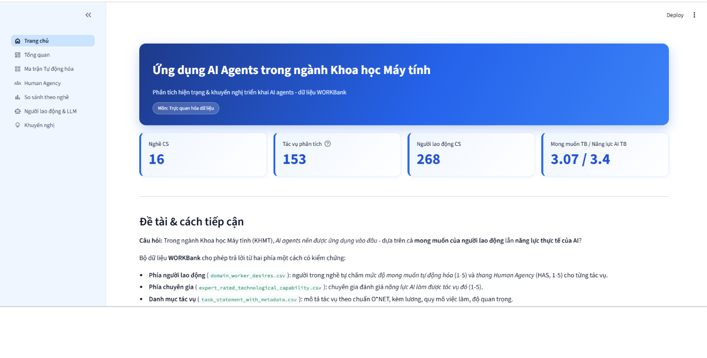
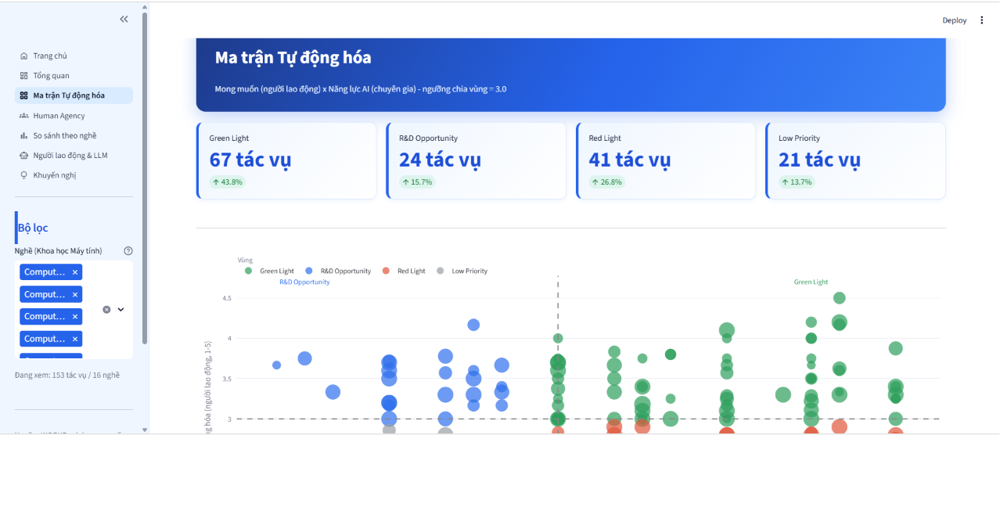

# Ứng dụng AI Agents trong Ngành Khoa học Máy tính

Phân tích hiện trạng và khuyến nghị triển khai AI agents trong ngành Khoa học Máy tính (KHMT), dựa trên dữ liệu khảo sát **WORKBank** — đối chiếu **mong muốn tự động hóa của người lao động** với **năng lực kỹ thuật thực tế của AI** theo đánh giá chuyên gia.

> Môn: Trực quan hóa dữ liệu

## Câu hỏi nghiên cứu

Trong ngành KHMT, AI agents nên được ứng dụng vào đâu — dựa trên **cả** mong muốn của người lao động **lẫn** năng lực thực tế của AI, không chỉ riêng một phía?

## Demo





## Dữ liệu

Bộ dữ liệu WORKBank gồm 4 file CSV:

| File | Nội dung |
|---|---|
| `task_statement_with_metadata.csv` | Danh mục tác vụ công việc theo chuẩn O\*NET |
| `domain_worker_metadata.csv` | Hồ sơ nhân khẩu học & thói quen dùng LLM của người lao động |
| `domain_worker_desires.csv` | Mức độ mong muốn tự động hóa do người lao động tự chấm (1-5) |
| `expert_rated_technological_capability.csv` | Năng lực AI làm được tác vụ đó, do chuyên gia công nghệ đánh giá (1-5) |

Phạm vi phân tích: lọc theo **mã O\*NET-SOC** (nhóm `15-12xx` + `11-3021.00`), không lọc theo tên nghề, để tránh nhận nhầm các nghề không thuộc Khoa học Máy tính.

Sau khi chỉ giữ các tác vụ có **đủ cả hai phía đánh giá** (người lao động và chuyên gia), dữ liệu phân tích còn lại: **153 tác vụ** thuộc **16 nghề CS**, từ **268 người lao động**.

## Cấu trúc dashboard (Streamlit)

| Trang | Nội dung |
|---|---|
| Trang chủ | Giới thiệu đề tài, 4 KPI tổng quan |
| Tổng quan | Quy mô dữ liệu, phân bố theo nghề, chất lượng dữ liệu |
| Ma trận Tự động hóa | Đối chiếu Mong muốn × Năng lực AI, chia 4 vùng ưu tiên |
| Human Agency | Mức độ người lao động muốn giữ vai trò khi có AI (thang H1–H5) |
| So sánh theo nghề | Nghề nào vừa được mong muốn, vừa khả thi nhất cho AI agent |
| Người lao động & LLM | Hiện trạng sử dụng LLM trong công việc thực tế |
| Khuyến nghị | Insight tổng hợp & đề xuất lộ trình triển khai |

### 4 vùng ưu tiên (Ma trận Tự động hóa)

| Vùng | Điều kiện | Ý nghĩa hành động |
|---|---|---|
| 🟢 **Green Light** | Muốn cao & AI làm được cao | Triển khai AI agent ngay — ưu tiên #1 |
| 🔵 **R&D Opportunity** | Muốn cao & AI chưa làm được | Cơ hội đầu tư R&D / công cụ |
| 🔴 **Red Light** | Muốn thấp & AI làm được cao | Cảnh báo: ép tự động hóa dễ gây phản kháng |
| ⚪ **Low Priority** | Muốn thấp & AI chưa làm được | Ưu tiên thấp |

## Insight chính

- **43.8%** tác vụ CS nằm vùng **Green Light** (vừa muốn, vừa khả thi) — nên triển khai trước.
- **26.8%** tác vụ nằm vùng **Red Light** — AI làm được nhưng người lao động chưa muốn, cần quản trị thay đổi cẩn thận, không chỉ chạy theo khả năng kỹ thuật.
- Năng lực AI trung bình theo chuyên gia (**3.40/5**) cao hơn mong muốn trung bình của người lao động (**3.07/5**) — công nghệ đang đi nhanh hơn mong muốn.
- LLM đã thâm nhập sâu vào việc viết code và tìm kiếm thông tin, nhưng còn ít được dùng cho thiết kế hệ thống — đây là khoảng trống cho AI agent tiếp theo.
- Giả thuyết "sợ mất việc làm giảm mong muốn tự động hóa" được kiểm định bằng t-test nhưng **không có ý nghĩa thống kê** (p = 0.64) — không đủ căn cứ để khẳng định.

## Cài đặt & chạy thử

```bash
# Clone repo
git clone https://github.com/<username>/<ten-repo>.git
cd <ten-repo>

# Tạo virtual environment (khuyến nghị)
python -m venv .venv
.venv\Scripts\activate          # Windows
# source .venv/bin/activate     # macOS/Linux

# Cài thư viện
pip install -r requirements.txt

# Chạy dashboard
streamlit run app.py
```

Mở trình duyệt tại `http://localhost:8501`.

## Cấu trúc project

```
.
├── app.py                  # Điểm vào, khai báo điều hướng
├── home.py                 # Trang chủ
├── src/
│   ├── config.py           # Hằng số, ngưỡng, định nghĩa phạm vi CS
│   ├── data_loader.py       # Đọc, lọc, ghép dữ liệu
│   ├── analysis.py          # Tính toán chỉ số, xếp hạng
│   └── ui.py                # Theme, bộ lọc dùng chung
├── views/                   # 6 trang phân tích
├── *.csv                    # Dữ liệu nguồn WORKBank
└── requirements.txt
```

## Công cụ sử dụng

- **VS Code** — viết và debug code
- **Streamlit** — xây dashboard tương tác
- **Plotly** — biểu đồ tương tác (scatter, bar, heatmap)
- **Pandas** — xử lý và tổng hợp dữ liệu
- **GitHub** — lưu trữ & trình bày kết quả

## Hạn chế dữ liệu

- Dữ liệu mong muốn tự động hóa là **tự đánh giá chủ quan** của người tham gia khảo sát, không phải đo lường khách quan.
- Chỉ 153/2131 tác vụ gốc có đủ cả hai phía đánh giá — phần còn lại bị loại khỏi phân tích do thiếu dữ liệu đối chiếu.
- Ngưỡng phân loại 3.0 (điểm giữa thang 1–5) là lựa chọn có thể tranh luận, không phải giá trị được kiểm định tối ưu.
- Thang Human Agency Scale đo **mong muốn** giữ vai trò của con người, không đo khả năng kỹ thuật thực tế để giao quyền.


